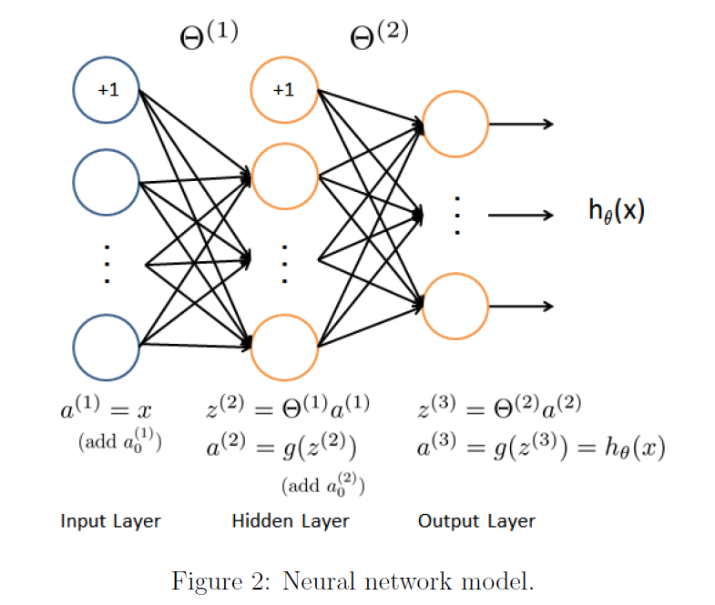
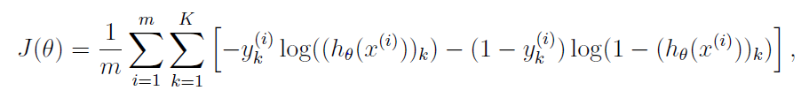
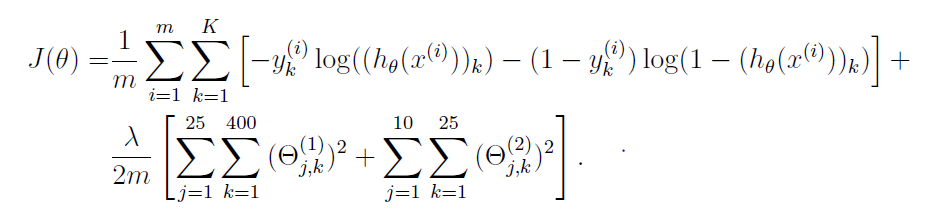
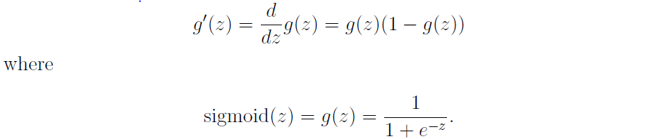
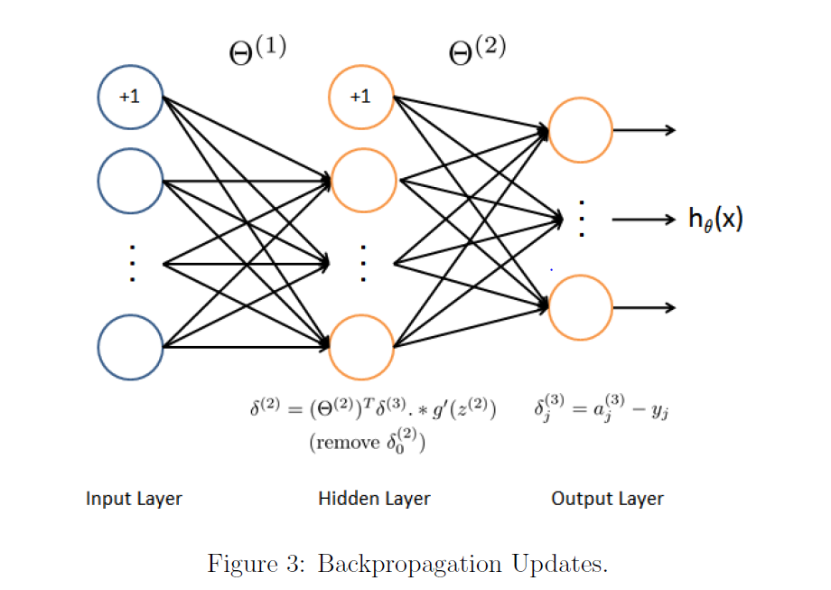
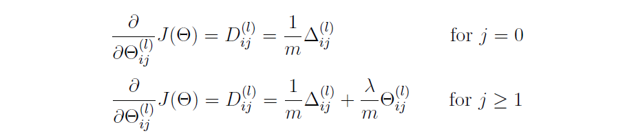

# Week 5 - Neural Network Learning

>In this assignment, I implemented the backpropagation algorithm for neural
networks and apply it to the task of hand-written digit recognition.

 

**Files included in this exercise**:

| Functions        | Explanations           |
| ---------------- |:----------------------:|
|ex4.m | Octave/MATLAB script that steps you through the exercise
|ex4data1.mat | Training set of hand-written digits
|ex4weights.mat | Neural network parameters for exercise 4
|submit.m | Submission script that sends your solutions to our servers
|displayData.m | Function to help visualize the dataset
|fmincg.m | Function minimization routine (similar to fminunc)
|sigmoid.m | Sigmoid function
|computeNumericalGradient.m | Numerically compute gradients
|checkNNGradients.m | Function to help check your gradients
|debugInitializeWeights.m | Function for initializing weights
|predict.m | Neural network prediction function
| sigmoidGradient.m | Compute the gradient of the sigmoid function (*)
| randInitializeWeights.m | Randomly initialize weights (*)
| nnCostFunction.m | Neural network cost function (*)

*The functions have been implemented by me

 

<h2>1. Neural Networks</h2>

In the previous exercise, I implemented feedforward propagation for neural networks and used it to predict handwritten digits with the weights that are already given. In this exercise, I implemented the backpropagation algorithm
to learn the parameters for the neural network.

<h4>1.1 Dataset</h4>

The ex3data1.mat contains 5000 training examples of handwritten digits (This is a subset of the MNIST handwritten digit dataset). Each training example is a 20 pixel by 20 pixel grayscale image of the digit. Each pixel is represented by a floating point number indicating the grayscale intensity at that location. 

The 20 by 20 grid of pixels is "unrolled" into a 400-dimensional vector. Each of these training examples becomes a single row in our data matrix X. This gives us a 5000 by 400 matrix X where every row is a training example for a handwritten digit image.

The second part of the training set is a 5000-dimensional vector y that contains labels for the training set. To make things more compatible with Octave/MATLAB indexing, where there is no zero index, we have mapped the digit zero to the value ten. Therefore, a "0" digit is labeled as "10", while the digits "1" to "9" are labeled as "1" to "9" in their natural order.

The file can be read directly by using the _load_ command.
 

<h4>1.2 Model representation</h4>

The neural network,that I used, shown in Figure 2:

It has 3 layers: 
* an input layer 
* a hidden layer
* an output layer 

Recall that our inputs are pixel values of
digit images. Since the images are of size 20x20, this gives us 400 input layer
units (excluding the extra bias unit which always outputs +1). As before,
the training data will be loaded into the variables X and y.

I have been provided with a set of network parameters
already trained. These are stored in '_ex3weights.mat_' and will be
loaded by _ex3 nn.m_ into Theta1 and Theta2. The parameters have dimensions
that are sized for a neural network with 25 units in the second layer and 10
output units (corresponding to the 10 digit classes).

<h4>1.3 Feedforward and cost function </h4>

> In this part, I implemented the cost function and gradient for the neural network.

Firstly, I write a code for the cost function without regularization. The formula of cost function without regularization is that:

The algorithm of this formula consist of these steps: 

* First of all, I calculated h(x). 
* Then I recoded the labels as vectors containing only values 0 or 1. The original labels were 1, 2, ..., 10, for the purpose of training a neural network, we need to recode labels. For example, if x(i) is an image of the digit 5, then the corresponding y(i) should be a 10-dimensional vector with y(5) = 1, and the other elements equal to 0.
* Then I calculated the summation of errors for each labels.
* Finally, The summation of errors for the all examples in the dataset were done.

The cost of this function is 0.287629.

<h4>1.3 Regularized cost function</h4>

The cost function for neural networks with regularization is given by:

In this part of the exercise, I have added regularization terms for both theta1 and theta2.

The new cost of this function become about 0.383770.

<h2>2. Backpropagation </h2>

> In this part of the exercise, I implemented the backpropagation algorithm to compute the gradient for the neural network cost function.

<h4> 2.1 Sigmoid gradient </h4>

To compute backpropagation algorithm, we need gradient for the sigmoid function. Firstly, I implemented the sigmoid gradient function.

The formula of the sigmoid gradient function is that:

<h4> 2.2 Random initialization </h4>

When training neural networks, it is important to randomly initialize the parameters for symmetry breaking. One effective strategy for random initialization is to randomly select values for theta(l) uniformly in the range [e,-e].

I should use the e value as 0,12.

<h4> 2.3 Backpropagation </h4>

The intuition behind the backpropagation algorithm is as follows:
 
* Given a training example ( x(t), y(t) ), we will first run a "forward pass" to compute all the activations throughout the network, including the output value of the hypothesis h(x). 
* Then, for each node j in layer l, we would like to compute an "error term" ej(l) that measures how much that node was "responsible" for any errors in our output.

For an output node, we can directly measure the difference between the network's activation and the true target value, and use that to de ne ej³ (since layer 3 is the output layer). For the hidden units, you will compute ej(l) based on a weighted average of the error terms of the nodes in layer (l + 1).

I implemented the steps 1 to 4 in a loop that processes one example
at a time. Here is the steps:

1. Set the input layer's values (a¹) to the t-th training example x(t). Perform a feedforward pass 
([Figure 2](images/figure-2.PNG)), computing the activations (z², a², z³, a³) for layers 2 and 3.

2. For each output unit k in layer 3 (the output layer), set 

where yk &isin; {0,1} indicates whether the current training example belongs to class k (yk = 1), or if it belongs to a different class (yk = 0).

3. For the hidden layer l = 2, set

4. Accumulate the gradient from this example using the following formula. 

5. Obtain the (unregularized) gradient for the neural network cost function by dividing the accumulated gradients by 1/m

6. After I have computed &#8710;(l) ij using backpropagation, I added regularization using this formula:
