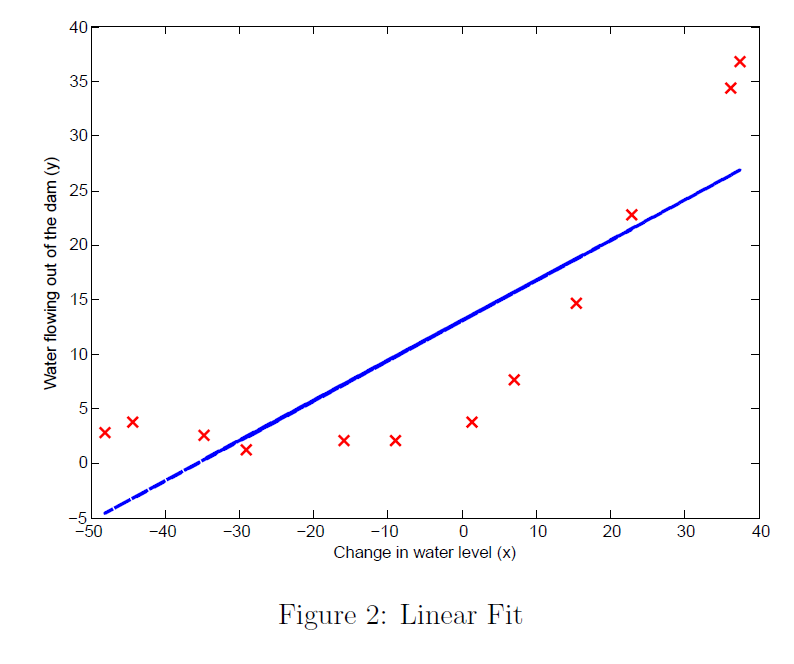

# Week 6 | Regularized Linear Regression and Bias/Variance

>In this exercise, I implemented regularized linear regression and use it to study models with different bias-variance properties.

 

**Files included in this exercise**:

| Functions        | Explanations           |
| ---------------- |:----------------------:|
|ex5.m | Octave/MATLAB script that steps you through the exercise
|ex5data1.mat | Dataset
|submit.m | Submission script that sends your solutions to our servers
|featureNormalize.m | Feature normalization function
|fmincg.m | Function minimization routine (similar to fminunc)
|plotFit.m | Plot a polynomial t
|trainLinearReg.m | Trains linear regression using your cost function
| linearRegCostFunction.m | Regularized linear regression cost func-
tion*
| learningCurve.m | Generates a learning curve*
| polyFeatures.m | Maps data into polynomial feature space*
| validationCurve.m | Generates a cross validation curve*

*The functions have been implemented by me

 

<h2>1. Regularized Linear Regression</h2>

> In this part, I implemented regularized linear regression to predict the amount of water owing out of a dam using the change of water level in a reservoir.

<h4> 1.1 Visualizing the dataset </h4>

I have began by visualizing the dataset containing historical records on the
change in the water level, x, and the amount of water 
owing out of the dam,
y.

This dataset is divided into three parts:

* A training set that your model will learn on: X, y
* A cross validation set for determining the regularization parameter:
Xval, yval
* A test set for evaluating performance. These are "unseen" examples
which your model did not see during training: Xtest, ytest

Figure-1 shows the data:

<h4> 1.2 Regularized linear regression cost function </h4>

The cost function of regularized linear regression:

where &lambda; is a regularization parameter which controls the degree of regularization (thus, help preventing overfitting). The regularization term puts a penalty on the overal cost J. As the magnitudes of the model parameters &theta;j increase, the penalty increases as well.

The error of this function is 303.993

<h4> 1.3 Regularized linear regression gradient </h4>

Correspondingly, the partial derivative of regularized linear regression's cost
for &theta;j is defined as

After the calculation, the thetas become [-15.30; 598.250].

<h4> 1.4 Fitting linear regression </h4>

In this part, we set regularization parameter &lambda; to zero. Because our current implementation of linear regression is trying to fit a 2-dimensional &theta;, regularization will not be incredibly helpful for a &theta; of such low dimension. The best fit line tells us that the model is not a good t to the data because the data has a non-linear pattern.

<h2> 2 Bias-variance </h2>

>An important concept in machine learning is the bias-variance tradeoff. Models with high bias are not complex enough for the data and tend to underfit,
 while models with high variance overfit to the training data.
 
<h4> 2.1 Learning curves </h4>

I implemented code to generate the learning curves that will be useful in debugging learning algorithms. Recall that a learning curve plots training and cross validation error as a function of training set size.

To plot the learning curve, we need a training and cross validation set error for different _training_ set sizes. To obtain different training set sizes, I used different subsets of the original training set X. Specifically, for a training set size of i, I used the first i examples ( i.e., X (1:i,:) and y (1:i) ).

After learning the &theta; parameters, you should compute the error on the training and cross validation sets. Recall that the training error for a dataset is
defined as

In particular, note that the training error does not include the regularization term. One way to compute the training error is to use your existing cost function and set &lambda; to 0 only when using it to compute the training error and cross validation error. When you are computing the training set error, make sure you compute it on the training subset (i.e., X(1:n,:) and y(1:n)) (instead of the entire training set). However, for the cross validation error, you should compute it over the entire cross validation set.

In Figure 3, you can observe that both the train error and cross validation error are high when the number of training examples is increased. This reflects a **high bias** problem in the model the linear regression model is too simple and is unable to fit our dataset well.